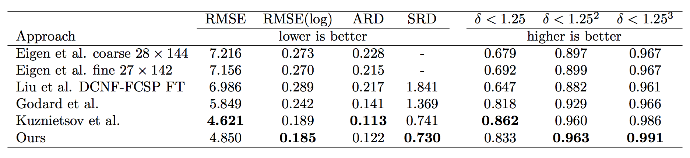
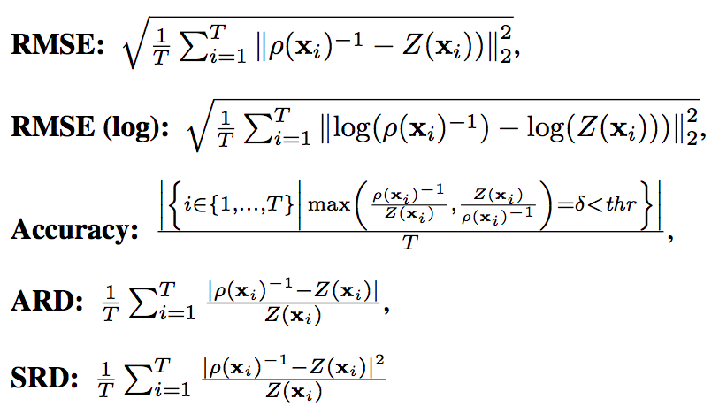

# I2D: Single Image Depth Estimation with FPN

[![License][license]][license-url]

A simple end-to-end model with fast convergence that achieves state-of-the-art performance in depth prediction. This is a class project for Advanced Computer Vision (CS 7476) at Georgia Tech. In this project, we used a Feature Pyramid Network (FPN) backbone to estimate depth map from a single input RGB image. We tested the performance of our model on the NYU Depth V2 Dataset (Official Split) and the KITTI Dataset (Eigen Split).

## Requirements

* Python 3
* Jupyter Notebook (for visualization)
* PyTorch 
  * Tested with PyTorch 0.3.0.post4
* CUDA 8 (if using CUDA)


## To Run

```
python3 main_fpn.py --cuda --bs 6
```
To continue training from a saved model, use
```
python3 main_fpn.py --cuda --bs 6 --r True --checkepoch 10
```
To visualize the reconstructed data, run the jupyter notebook in vis.ipynb.


## Data Processing
### NYU Depth V2 Dataset
* The NYU Depth V2 dataset contains a variety of indoor scenes, with 249 scenes for training and 215 scenes for testing. We used the official split for training and testing.
* Following previous works, we used the official toolbox which uses the Colorization method proposed by Levin et al. to fill in the missing values of depth map in the training set.
* To make comparison with previous works, we evaluated our model using the official evaluation set of 654 densely labeled image pairs.
* The images and depth maps in the NYU Depth V2 dataset are both of size 640x480. During training, we loaded the images as-is, and downscaled the depth maps to 160x120. The proposed model produces depth maps of size 160x120, and upsampled to the original size for evaluation.
* We employed random crop, random rotate of 10 degrees, color jitter of brightness, contrast, saturation and hue of variation 0.1. To save time during training, we performed data augmentation in advance by running ```dataset/augment.py```.


### KITTI Dataset
* The KITTI dataset consists of 61 outdoor scenes with “city”, “road”, and “residential” categories. Following the official tutorial, we got about 22k image and depth map pairs in the training dataset.
* Following previous works, we used the same NYU tool box to fill in the missing values of the sparse depth maps in the training set.
* To compare with the performances of previous studies, we evaluate on the test split of KITTI dataset proposed by Eigen et al.
* The images and depth maps in the KITTI dataset are both of size about 1280x384. During training, we downscaled the images to size 640x192, and downscaled the depth maps to 160x48. The proposed model produces depth maps of size 160x48, and upsampled to the original size for evaluation.
* For better visualization in quantitative evaluation, we filled in the missing depth value in the ground truth depth map.

## Model

<p align="center"></p>

* We used Feature Pyramid Network (FPN) with ResNet101 as backbone (shaded yellow), loaded ImageNet pretrained weight as weight initialization.
* We used pixel-shuffle for upsampling and fuse feature maps with add operation; bilinear interpolation is employed after pixel-shuffle to deal with inconsistent feature map size.
* Two consecutive 3x3 convolutions for feature processing.
* No non-linearity in the top-down branch of FPN, and ReLU in other convolution layers, and Sigmoid in the prediction layer for better stability.
* Trained on the weighted sum of the depth loss, the gradient loss, and the normal loss for 20 epochs for the NYU Depth V2 dataset, and 40 epochs for the KITTI dataset; gradient loss added after epoch 1, and normal loss added after epoch 10.
* Outputs prediction of size ¼, and evaluated after bilinear upsampling.

## Loss Function

We employed three parts in the loss function in our model. The loss is a weighted sum of 3 parts: the depth loss, the gradient loss and the surface normal loss.

### Depth Loss


The depth loss is RMSE in log scale, which we found converges better than L1 and L2 norm. Supervising in log scale makes the classifier focus more on closer objects.

### Gradient Loss


The gradient of depth maps is obtained by a Sobel filter; the gradient loss is the L1 norm of the difference.

### Surface Normal Loss
We also employed the normal vector loss proposed by Hu et al., which helps refining details.


The weight ratio between the three loss was set to 1:1:1.

## Qualitative Evaluation
### NYU Depth V2
<p align="center"></p>

### KITTI
Comparison with state-of-the-art methods:
<p align="center"></p>
More comparison:
<p align="center"></p>


## Quantitative Evaluation
### NYU Depth V2
Performance comparison on the NYU Depth V2 dataset. Ours: proposed framework trained with depth, gradient, and normal loss:
<p align="center"></p>

### KITTI
<p align="center"></p>

We use the following depth evaluation metrics used by Eigen et al.:
<p align="center"></p>
where T is the number of valid pixels in the test set.

## Discussion

* FPN is an effective backbone for monocular depth estimation because of its ability to extract features and semantics at different scales. It can achieve its potential if guided by proper loss functions.
* Gradient and normal losses help prevent the model getting stuck in local optimum and guide it toward better convergence, as shown in the ablation study.

## Related Work


## Other Attempts this Semester


## Future Work


## To-dos

- [x] Add visualization ipynb
- [ ] Add support for the ScanNet Dataset
- [ ] Add code for CVPR 2018 ROB Challenge

<!-- Markdown link & img dfn's -->
[license]: https://img.shields.io/github/license/mashape/apistatus.svg
[license-url]: https://github.com/xanderchf/i2d/blob/master/LICENSE

## References
* Silberman, Nathan, et al. "Indoor segmentation and support inference from rgbd images." European Conference on Computer Vision. Springer, Berlin, Heidelberg, 2012.
* Geiger, Andreas, et al. "Vision meets robotics: The KITTI dataset." The International Journal of Robotics Research 32.11 (2013): 1231-1237.
* Eigen, D., Puhrsch, C., Fergus, R.: Depth map prediction from a single image using a multiscale
deep network. In: Advances in neural information processing systems (NIPS). (2014)
2366–2374
* Levin, Anat, Dani Lischinski, and Yair Weiss. "Colorization using optimization." ACM Transactions on Graphics (ToG). Vol. 23. No. 3. ACM, 2004.
* Hu, Junjie, et al. "Revisiting Single Image Depth Estimation: Toward Higher Resolution Maps with Accurate Object Boundaries." arXiv preprint arXiv:1803.08673 (2018).
